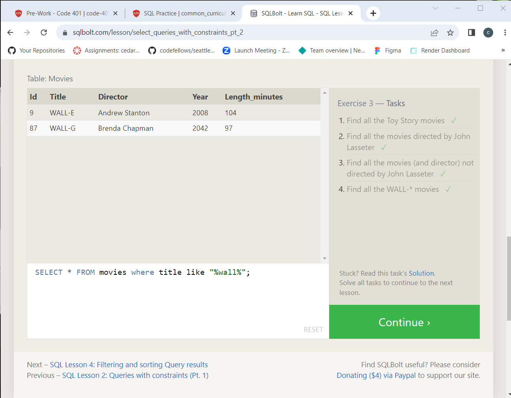

# SQL Practice

[SQL Database Tutorial for Beginners](https://www.computer-pdf.com/3-sql-database-tutorial-for-beginners)  

 SQL "...is a query language used to access a database from a language like C/C++, Java, or a web application."  
 "Commonly used databases include Oracle, SQL Server, MySQL, Sybase, and PostgreSQL."
 It's the language of most DBs.

SQL Bolt Tutorials  
<https://sqlbolt.com/>  

.png)
.png)

- [Go to TOC](README.md)
